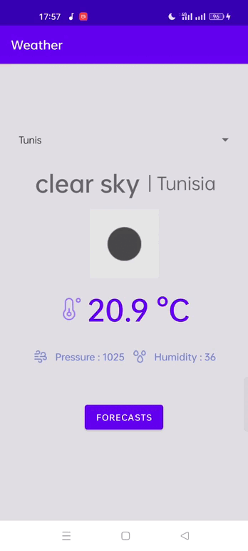
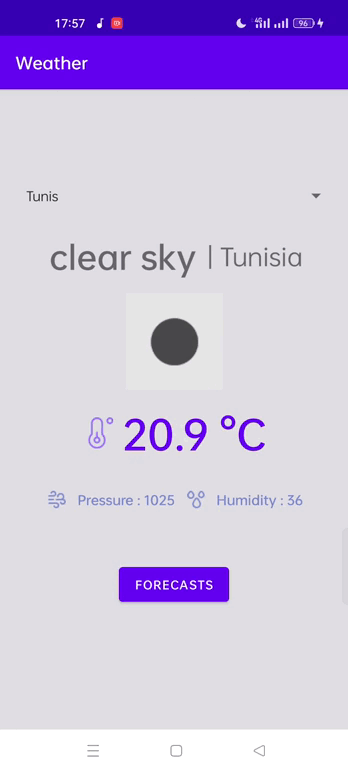

# WeatherApp
This app is made to visualize weather information by city using open weather map API
# Screenshots and Demo

<table align="center">
  <tr>
    <td>Weather</td>
     <td>Forecast</td>
    
  </tr>
  <tr>
    <td></td>
    <td></td>
  </tr>
 </table>
 
